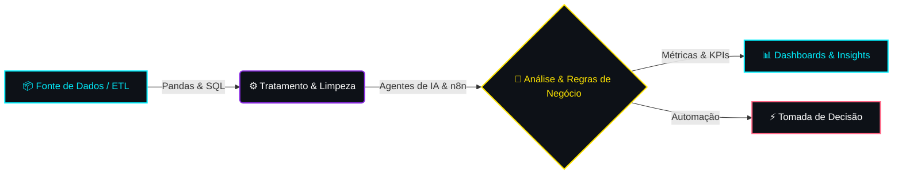

# LUCILA VITÓRIA
### **Data Analyst | AI & Automation Enthusiast | Tech Explorer**

---

---

## ⚡ // SOBRE MIM

> **"Transformando riscos em processos e dados em decisões estratégicas."**

Sou graduanda no **3º semestre de Análise e Desenvolvimento de Sistemas** com bagagem sólida na área de **Segurança do Trabalho**, o que me deu uma visão única para **análise de risco, atenção a falhas, prevenção e regras de negócio complexas**. 

Hoje, aplico esse mindset analítico no ecossistema de **Tecnologia, Análise de Dados e Inteligência Artificial**, criando soluções que otimizam tempo e automatizam processos repetitivos.

### Utilização de IA para dados
Acredito firmemente que a **utilização da IA com propriedade e critérios técnicos** não substitui a análise humana, mas atua como um **multiplicador de alta performance**. Através da combinação de **Python, SQL, Prompt Engineering e Agentes de IA**, desenvolvo automações e dashboards que aceleram tomadas de decisão e geram impacto real de negócio.

---

### ⚙️ // DATA & AI PIPELINE WORKFLOW

## 📈 // VISUALIZAÇÃO DE DADOS

| 💳 **Distribuição de notas dos episódios de One Piece** | 🏴‍☠️ **Comparação entre as avaliações dos episódios** |
| :---: | :---: |
|  |  |
| **Techs:** Python, Matplotlib, Pandas | **Techs:** Python, Matplotlib, Data Cleaning |
| *Comparação de notas dos episódios do anime* | *Distribuição de notas e análise temática de episódios* |

## 🛠️ // STACKS E FERRAMENTAS

### **Data & Artificial Intelligence**

### **Fullstack & Systems Development**

### **Environment & Tools**

---

## 🚀 // DATASETS & PROJETOS

Acesse abaixo os principais repositórios de análise de dados e projetos desenvolvidos:

| Repositório | Descrição | Link do Projeto |
| :--- | :--- | :---: |  
| 🏴‍☠️ **Análise One Piece** | Tratamento de dados, métricas de avaliação e geração de dashboards em Python. |  |
| 📊 **Análise de Datasets 1** | Pipeline de Machine Learning e Detecção de Fraudes em cartões com Python. |  |
| 📈 **Agentes de IA** | Experimento prático na criação de um agente de IA financeiro que fornece dicas e orientações de finanças. |  |

---

## 📊 // GITHUB ANALYTICS

  <table>
    <tr>
      <td align="center">
        
      </td>
    </tr>
  </table>

---

## 📬 // SE CONECTE COMIGO

 

*⚡ "Sorte é o que acontece quando a preparação encontra a oportunidade." ⚡*

