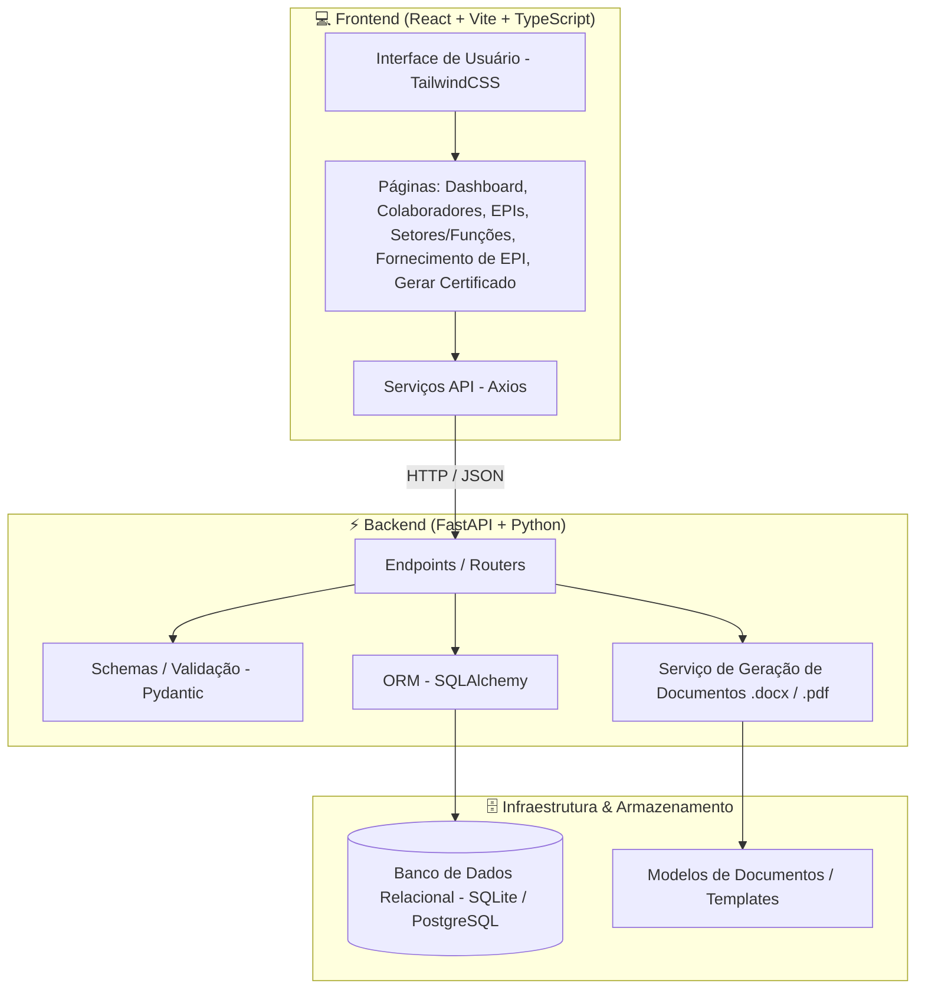
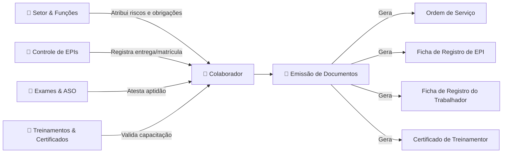
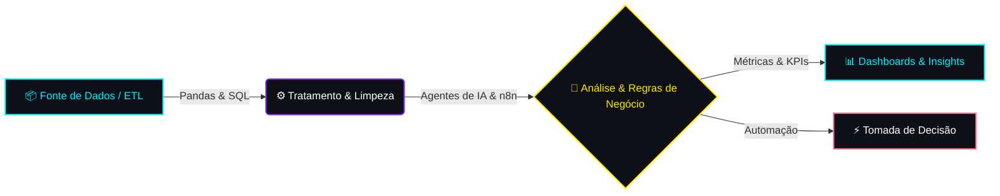

# LUCILA VITÓRIA
### ** Fullstack Developer | Data Analyst | AI & Automation Enthusiast | Tech Explorer **

---

---

## ⚡ // SOBRE MIM

> **"Transformando riscos em decisões e conhecimento de negócio em sistema."**

Estou desenvolvendo um sistema de gestão de segurança fullstack com objetivo de: facilitar o cadastro de pessoas, organização de documentos, emissão de certificados e centralização de objetividades legais. Um sistema que irá unificar as dores do setor de **Segurança do Trabalho** com **Tecnologia**.  

Há vários anos trabalhando no setor industrial, pude perceber as dores com as burocracias e exigências do dia a dia feitas de forma arcaica: no papel e caneta. Hoje, busco facilitar a rotina integrando automações, análise de dados, sistemas e inteligência artificial.

### Utilização de IA para dados
Acredito firmemente que a **utilização da IA com propriedade e critérios técnicos** não substitui a análise humana, mas atua como um **multiplicador de alta performance**. Através da combinação de **Python, SQL, Prompt Engineering e Agentes de IA**, desenvolvo automações e dashboards que aceleram tomadas de decisão e geram impacto real de negócio.

---

  

    
### 🖥️ // DESENVOLVIMENTO FULLSTACK    

    
O projeto atual denominado sicherPlan tem como finalidade juntar a tecnologia para facilitar o dia a dia dos profissionais de RH e segurança, que lidam com diversas documentações, obrigatoriedades legais, procedimentos padrões que muita das vezes são realizados manualmente, desgastando tempo que poderia ser utilizado para análises e implementações.   

A estrutura do projeto:  

```mermaid
graph TD
    %% User Layer
    subgraph Frontend ["💻 Frontend (React + Vite + TypeScript)"]
        UI[Interface de Usuário - TailwindCSS]
        Pages[Páginas: Dashboard, Colaboradores, EPIs, Setores/Funções, Fornecimento de EPI, Gerar Certificado]
        Services[Serviços API - Axios]
    end

    %% API / Backend Layer
    subgraph Backend ["⚡ Backend (FastAPI + Python)"]
        API[Endpoints / Routers]
        Schemas[Schemas / Validação - Pydantic]
        DocService[Serviço de Geração de Documentos .docx / .pdf]
        ORM[ORM - SQLAlchemy]
    end

    %% Storage & Database
    subgraph Infra ["🗄️ Infraestrutura & Armazenamento"]
        DB[(Banco de Dados Relacional - SQLite / PostgreSQL)]
        Templates[Modelos de Documentos / Templates]
    end

    %% Relationships
    UI --> Pages
    Pages --> Services
    Services -->|HTTP / JSON| API
    API --> Schemas
    API --> ORM
    API --> DocService
    ORM --> DB
    DocService --> Templates

```

```mermaid
flowchart LR
    Colaborador[👤 Colaborador]
    SetorFuncao[🏢 Setor & Funções]
    EPI[🥾 Controle de EPIs]
    ASO[🏥 Exames & ASO]
    Certificados[📜 Treinamentos & Certificados]
    Docs[📄 Emissão de Documentos]

    SetorFuncao -->|Atribui riscos e obrigações| Colaborador
    EPI -->|Registra entrega/matrícula| Colaborador
    ASO -->|Atesta aptidão| Colaborador
    Certificados -->|Valida capacitação| Colaborador

    Colaborador --> Docs
    Docs -->|Gera| OrdServ[Ordem de Serviço]
    Docs -->|Gera| FichaEPI[Ficha de Registro de EPI]
    Docs -->|Gera| FichaReg[Ficha de Registro do Trabalhador]
    Docs -->|Gera| Cert[Certificado de Treinamentor]
```

### ⚙️ // DATA & AI PIPELINE WORKFLOW  

Também utilizando análise de dados para construção de sistemas.

```mermaid
graph LR
    A[📦 Fonte de Dados / ETL] -->|Pandas & SQL| B(⚙️ Tratamento & Limpeza)
    B -->|Agentes de IA & n8n| C{🧠 Análise & Regras de Negócio}
    C -->|Métricas & KPIs| D[📊 Dashboards & Insights]
    C -->|Automação| E[⚡ Tomada de Decisão]

    style A fill:#0D1117,stroke:#00F0FF,stroke-width:2px,color:#00F0FF
    style B fill:#0D1117,stroke:#8A2BE2,stroke-width:2px,color:#fff
    style C fill:#0D1117,stroke:#FFE600,stroke-width:2px,color:#FFE600
    style D fill:#0D1117,stroke:#00F0FF,stroke-width:2px,color:#00F0FF
    style E fill:#0D1117,stroke:#FF6584,stroke-width:2px,color:#fff
```

## 🛠️ // STACKS E FERRAMENTAS

### **Data & Artificial Intelligence**

### **Fullstack & Systems Development**

### **Environment & Tools**

---

## 🚀 // DATASETS & PROJETOS

Acesse abaixo os principais repositórios de análise de dados e projetos desenvolvidos:

| Repositório | Descrição | Link do Projeto |
| :--- | :--- | :---: |  
| 🦺 **sicherPlan** | Sistema de Gestão de Segurança |  |
| 🤖 **Bot Tech Girls** | Bot de Discord para automação de notícias com filtro de agente de IA. |  |
| 📈 **Agentes de IA** | Experimento prático na criação de um agente de IA financeiro que fornece dicas e orientações de finanças. |  |

---

## 📬 // SE CONECTE COMIGO

 

*⚡ "Sorte é o que acontece quando a preparação encontra a oportunidade." ⚡*

